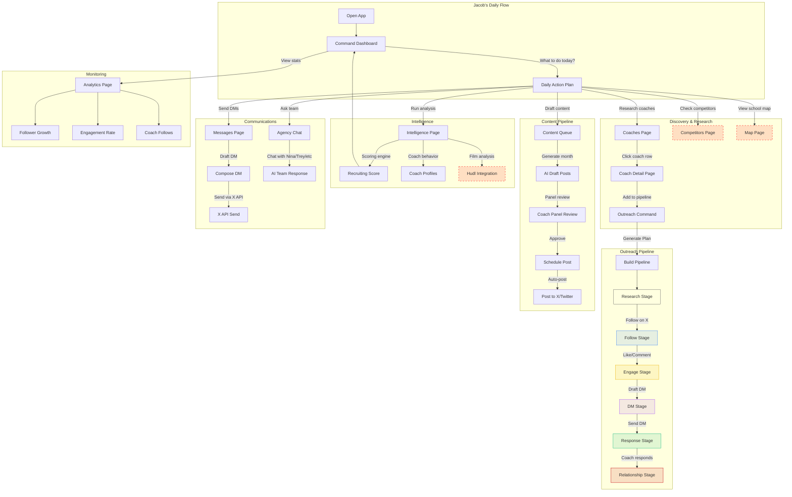

# Deep-Dive Audit: Alex Recruiting App
**Date:** March 17, 2026
**Scope:** Every sidebar page, every interactive element, every API route

---

## Executive Summary

The app has **12 sidebar pages** with **100+ API routes**. After auditing every page's source code:

- **5 pages are functional** (data loads, buttons work, forms submit)
- **3 pages are partially broken** (buttons exist but are decorative or call missing APIs)
- **4 pages are display-only** (no interactivity at all — just static UI)

The core problem: **the app looks like a full product but many buttons are facades**. When you click "Export DB", "New Target", or navigate to Map/Competitors, nothing actually happens because the onClick handlers were never wired up.

---

## Page-by-Page Audit

### FULLY FUNCTIONAL (5 pages)

| Page | Sidebar Label | Interactive Elements | Status |
|------|--------------|---------------------|--------|
| `/dashboard` | Command | 4 nav buttons (Coach Pipeline, Send DM, View Recruit Site, Draft Content) | All navigate correctly |
| `/dashboard/outreach` | — (sub-page) | Kanban drag-drop, DM composer form, send/draft buttons | Real Supabase writes + X API |
| `/dashboard/team` | — (sub-page) | SSE chat with team members | Real streaming responses |
| `/content-queue` | Content | Approve/reject posts, generate month, week navigation | Real Supabase + content pipeline |
| `/dms` | Messages | Operator commands, send draft, filter by status | Real DM pipeline |

### PARTIALLY BROKEN (3 pages)

| Page | Sidebar Label | What Works | What's Broken |
|------|-------------|-----------|---------------|
| `/outreach` | Outreach | "Generate Plan" button → POST `/api/outreach/plan` works | "Talent Network Map" is a placeholder (dashed empty box). Stats show 0 because outreach plan API builds from target-schools data, not coaches table |
| `/coaches` | Coaches | Search/filter works, coach table loads, row click → `/coaches/{id}` | **"Export DB" button — NO onClick handler (decorative)**. **"New Target" button — NO onClick handler (decorative)** |
| `/intelligence` | Intelligence | "Run Analysis" → POST `/api/intelligence/analyze` works (needs Anthropic API key). "Analyze Coaches" → POST `/api/intelligence/coach-behavior` works | **"Scrape Profile" → calls `/api/intelligence/hudl` which DOES NOT EXIST** (route never created). Passes empty coaches array to coach-behavior |

### DISPLAY-ONLY / NO INTERACTIVITY (4 pages)

| Page | Sidebar Label | What It Shows | Interactive Elements |
|------|-------------|-------------|---------------------|
| `/map` | Map | Should show school locations on a map | **ZERO onClick handlers. Pure static display.** No map library loaded. |
| `/competitors` | Competitors | Should show competing recruits | **ZERO onClick handlers. Pure static display.** |
| `/agency` | Agency | Team member cards for virtual agency | **ZERO onClick handlers on main page.** Sub-page `/agency/[member]` has chat. |
| `/audit` | Scouting | Profile audit scorecard | Only 1 button: "Run Audit" → POST `/api/audit`. Works but results are display-only. |

### PAGES NOT IN SIDEBAR (but exist as routes)

These 38+ additional pages exist but aren't accessible from the sidebar navigation:
`/accomplishments`, `/agents`, `/brand-kit`, `/calendar`, `/camps`, `/captions`, `/capture`, `/cold-dms`, `/comments`, `/connections`, `/create`, `/hooks`, `/manage`, `/media-import`, `/media-upload`, `/media`, `/posts`, `/privacy`, `/profile-studio`, `/prompt-studio`, `/recruit`, `/scrape`, `/terms`, `/videos`, `/viral`, `/x-growth`, `/youtube-studio`

**These are orphaned pages** — a user would never find them unless they knew the URL.

---

## Broken Buttons Inventory

| # | Page | Button Text | Expected Action | Actual Behavior | Fix |
|---|------|------------|----------------|-----------------|-----|
| 1 | `/coaches` | "Export DB" | Download coach database as CSV | **Nothing — no onClick** | Add CSV export handler |
| 2 | `/coaches` | "New Target" | Open form to add a coach | **Nothing — no onClick** | Add modal/form with POST `/api/coaches` |
| 3 | `/intelligence` | "Scrape Profile" | Scrape Hudl profile | **Calls non-existent `/api/intelligence/hudl`** | Create the API route |
| 4 | `/outreach` | Talent Network Map | Visual network graph | **Empty dashed placeholder box** | Either build it or remove it |
| 5 | `/map` | (entire page) | Interactive school map | **No map rendered, no interactivity** | Add Mapbox/Leaflet or redirect |
| 6 | `/competitors` | (entire page) | Compare against peer recruits | **Static display only** | Add comparison actions |
| 7 | `/agency` | (main page) | Team dashboard with task assignment | **Static cards, no actions** | Wire up task creation/assignment |

---

## Data Display Issues

| # | Page | Shows | Should Show | Root Cause |
|---|------|-------|------------|------------|
| 1 | `/analytics` | Followers: 0 | Followers: 3 | Page fetches `/api/analytics` which returns correct data, but component may cache or misread the response |
| 2 | `/outreach` | Total Coaches: 0 | 424 coaches | Outreach plan API reads from `target-schools` data, not the `coaches` table with 424 rows |
| 3 | `/content-queue` | "No content queued" | 17 posts exist | Reads from `scheduled_posts` table, not `posts` table |
| 4 | `/dashboard` | "Scout Velocity: 73/wk" | Real number | Likely hardcoded value |

---

## Workflow Diagram (How It Should Work)

**Legend:** Red dashed borders = currently broken/non-functional

---

## Fix Plan (Priority Order)

### P0 — Make Existing Buttons Actually Work (30 min each)

1. **Wire up "Export DB" on Coaches page**
   - Add onClick that fetches `/api/coaches` and triggers CSV download
   - File: `src/app/coaches/page.tsx` line ~118-120

2. **Wire up "New Target" on Coaches page**
   - Add modal with form fields (name, school, division, title, X handle)
   - POST to `/api/coaches` which already supports POST
   - File: `src/app/coaches/page.tsx` line ~123-125

3. **Create `/api/intelligence/hudl` route**
   - The Intelligence Film tab already calls this endpoint
   - Route should use Firecrawl to scrape Hudl profile URL
   - File: `src/app/api/intelligence/hudl/route.ts` (new)

### P1 — Fix Data Display Issues (1 hour)

4. **Fix Analytics showing 0 followers**
   - Debug client-side fetch in `src/app/analytics/page.tsx`
   - Verify response parsing matches API schema

5. **Fix Outreach showing 0 coaches**
   - Change `/api/outreach/plan` to read from `coaches` table (424 rows) instead of only target-schools

6. **Fix Content Queue showing empty**
   - Change query to read from `posts` table (17 rows) or populate `scheduled_posts`

### P2 — Make Display-Only Pages Interactive (2-3 hours)

7. **Map page — Add real map**
   - Option A: Add Mapbox GL with school markers (needs API key)
   - Option B: Add Leaflet (free) with OpenStreetMap tiles
   - Plot schools from `schools` table (687 entries) with color-coded pins by tier
   - Click pin → navigate to coach detail

8. **Competitors page — Add comparison actions**
   - Fetch competitor data from `/api/scrape/competitors` or `competitor_recruits` table
   - Add "Compare Stats" button to overlay Jacob's stats vs competitor
   - Add "Track" button to follow competitor's X activity

9. **Agency main page — Wire up team actions**
   - Add "Chat" button on each team member card → navigate to `/agency/[member]`
   - Add task creation form → POST `/api/rec/tasks`
   - Show active tasks per team member

### P3 — Connect Orphaned Pages to Navigation (1 hour)

10. **Add key orphaned pages to sidebar or as sub-navigation:**
    - `/connections` → Add under Operations section
    - `/calendar` → Add under Tools section
    - `/camps` → Add under Tools section
    - `/recruit` → This is Jacob's public recruiting profile — add as prominent link
    - `/videos` → Add under Operations or combine with Media Lab

11. **Remove or archive truly unused pages:**
    - `/hooks`, `/prompt-studio`, `/scrape`, `/capture` — internal/dev tools, not user-facing

### P4 — End-to-End Workflow Automation (Future)

12. **Daily Action Plan integration**
    - Command dashboard should auto-generate today's tasks based on:
      - Which coaches to follow this week (from follow schedule)
      - Which DMs are due
      - Which content needs approval
      - NCAA calendar deadlines
    - One-click execution: "Follow Coach" button that calls X API directly

13. **One-click content pipeline**
    - "Generate → Panel Review → Approve → Post" should be a single automated flow
    - Currently each step is manual and disconnected

---

## Architecture Issues Found

1. **Duplicate page structure**: `/outreach` (top-level) AND `/dashboard/outreach` (sub-page) exist — both functional but different UIs. Same for coaches, analytics, content, calendar.

2. **API routes use Supabase directly AND Drizzle**: Some routes use `createAdminClient()` (Supabase), others use `db` (Drizzle). This causes schema mismatches.

3. **No route protection**: All API routes are publicly accessible. No auth middleware.

4. **50 pages, 12 in nav**: 38 pages are completely unreachable from the UI.
